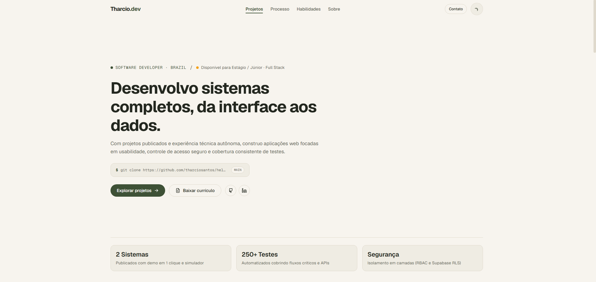

<div align="center">

# Tharcio Santos — Portfólio

Portfólio de Tharcio Santos, Desenvolvedor Full Stack com foco em sistemas, APIs e bancos de dados.

[Ver versão pública atual](https://tharcio-portfolio.vercel.app) · [LinkedIn](https://www.linkedin.com/in/tharcio-santos-dev/) · [Email](mailto:tharciosantos09@gmail.com)



</div>

---

## Sobre

Este projeto apresenta minha trajetória como estudante de Análise e Desenvolvimento de Sistemas e Desenvolvedor Full Stack. O portfólio reúne sistemas publicados, habilidades demonstradas em contexto e o processo que uso para evoluir cada projeto.

A interface segue uma direção editorial: hierarquia visual clara, leitura rápida, conteúdo organizado por evidências e uma paleta baseada em tons terrosos com verde musgo (moss green) como accent e âmbar vermilion como highlight. Dark e light mode compartilham os mesmos tokens semânticos, com contraste, foco visível e estados interativos consistentes.

---

## Proposta Visual e Estrutura

- **Portfólio editorial:** projetos apresentados por problema, solução, entrega e decisões técnicas.
- **ManutFlow como case principal:** produto em produção com autenticação, isolamento de dados em 3 camadas de segurança (proxy.ts, getUser(), RLS), gestão de equipamentos e ordens de manutenção, e 169 testes automatizados em 17 arquivos.
- **HelpFlow como case complementar:** aplicação com autenticação por credenciais e GitHub, recuperação de senha, controle de acesso RBAC, regras de negócio, banco relacional e deploy.
- **Projetos complementares:** DevLinks, Lista de Mercado e Crypto Dashboard aparecem como evidências adicionais.
- **Processo visível:** seção "Como eu trabalho" apresenta o fluxo de análise, escopo, implementação, teste e revisão.
- **Competências:** tecnologias organizadas por contexto de uso, em vez de uma lista genérica de ferramentas.

---

## O que este projeto demonstra

Mais do que uma vitrine, este repositório reúne práticas aplicadas em frontend e engenharia de software:

- **Arquitetura moderna:** Next.js 16 (Turbopack) com App Router, componentes organizados por responsabilidade e dados compartilhados fora da interface quando apropriado.
- **Sistema de design próprio:** tokens semânticos no Tailwind para fundos, superfícies, textos, bordas e accent verde musgo (`#3E5136`) com highlight âmbar (`#D95B30`) nos dois temas.
- **Componentização:** componentes reutilizáveis com React e TypeScript, como `Button`, `Pill`, `Section`, `SectionHeader`, `ProjectScreenShowcase` e `RevealOnScroll`.
- **Conteúdo organizado:** projetos, habilidades, experiências e constantes vivem em `src/data`; textos editoriais específicos permanecem próximos das respectivas seções.
- **Acessibilidade e responsividade:** navegação por teclado, foco visível, atributos ARIA, focus trap no menu mobile e layouts adaptados para diferentes larguras.
- **Interatividade controlada:** Navbar como Client Component para scroll spy, menu mobile e alternância de tema. Animações de entrada com IntersectionObserver e CSS transitions, sem dependências externas.
- **Scroll reveal global:** componente `RevealOnScroll` reutilizável com IntersectionObserver, sem listeners redundantes de scroll.
- **Micro-interações refinadas:** botões com sombra sutil que intensifica no hover, cards com `hover:-translate-y-1`, abas de projetos com sombra quando ativas e feedback visual com `active:scale-[0.98]`.
- **Barra de progresso de leitura:** `ReadingProgressBar` fixa no topo que preenche conforme o scroll, usando `scaleX` para performance.
- **ProjectScreenShowcase:** carousel de telas dos projetos com navegação por teclado, swipe gestures, auto-play pausável e lightbox modal em alta resolução.
- **Hero otimizado:** CTA principal ampliado com tamanho e contraste diferenciados, foto de perfil aumentada na seção About para maior presença visual.
- **Performance:** bundle otimizado via **Turbopack** (padrão do Next 16), imagens em WebP/AVIF com quality tiers, ícones SVG locais, CSS crítico otimizado e Analytics carregado dinamicamente.
- **SEO técnico:** sitemap, `robots.txt`, Open Graph, Twitter Card, Schema.org e `themeColor` por preferência de tema.
- **Integração contínua:** GitHub Actions validando formatação, lint, tipos, testes e build.
- **Qualidade de código:** Vitest, Testing Library, ESLint, Prettier, Husky e lint-staged, com 71 testes automatizados cobrindo componentes, hooks e dados.

### Metas Lighthouse

| Categoria      | Meta |
| -------------- | ---- |
| Performance    | ≥ 95 |
| Accessibility  | ≥ 95 |
| Best Practices | ≥ 95 |
| SEO            | ≥ 95 |

Os resultados medidos devem ser atualizados apenas após uma nova auditoria da versão publicada.

---

## Projetos

### Case principal — ManutFlow

Sistema completo para controle de equipamentos, ordens de manutenção, responsáveis, prioridades e histórico. Inclui autenticação com Supabase Auth, três camadas de segurança (proxy.ts, getUser(), RLS), cadastro e gestão de equipamentos, ordens de serviço com controle de status, filtros, busca textual e dashboard com indicadores.

- **Destaques:** Acesso demo com 1-clique e dados pré-carregados, 169 testes automatizados em 17 arquivos, CRUD com busca, filtros, paginação, histórico e acompanhamento de prazos.
- **Stack:** Next.js, React, TypeScript, Tailwind CSS, Supabase, PostgreSQL
- **Links:** [Aplicação](https://manutflow.vercel.app) · [Código](https://github.com/tharciosantos/manutflow)

### Case complementar — HelpFlow

Sistema de help desk Full Stack para abertura, acompanhamento e gerenciamento de chamados internos, com autenticação por credenciais e GitHub, recuperação de senha, controle de acesso por perfil e propriedade dos chamados.

- **Destaques:** Acesso demo com 1-clique (perfis Client e Agent), CRUD paginado de tickets, validação com Zod, rate limiting e testes unitários e E2E.
- **Stack:** Next.js, React, JavaScript, Prisma, Supabase, PostgreSQL, NextAuth, Zod, Vitest, Cypress
- **Links:** [Aplicação](https://helpflow.vercel.app/) · [Código](https://github.com/tharciosantos/helpflow)

### Projetos complementares

#### DevLinks

Perfil personalizável com avatar, links dinâmicos, upload via Cloudinary, estado sincronizado com React Query e testes end-to-end com Cypress.

- **Stack:** React, Vite, JavaScript, Tailwind CSS, React Query, Cloudinary, Cypress, GitHub Actions
- **Links:** [Aplicação](https://devlinks-web-api.vercel.app/) · [Código](https://github.com/tharciosantos/devlinks-web) · [API](https://github.com/tharciosantos/devlinks-api)

#### Lista de Mercado

PWA mobile-first para organizar compras, com funcionamento offline, persistência local e compartilhamento pelo WhatsApp.

- **Stack:** React, Vite, PWA, Tailwind CSS, Local Storage
- **Links:** [Aplicação](https://lista-mercado-sage.vercel.app/) · [Código](https://github.com/tharciosantos/lista-mercado)

#### Crypto Dashboard

Dashboard para consulta de criptomoedas com busca, rotas dinâmicas, renderização client-side e tratamento de estados ao consumir a API da CoinGecko.

- **Stack:** Next.js, React, CoinGecko API
- **Links:** [Aplicação](https://crypto-dashboard-five-sandy.vercel.app/) · [Código](https://github.com/tharciosantos/crypto-dashboard)

---

## Seções do Portfólio

1. **Hero:** posicionamento Full Stack em sistemas, APIs e bancos de dados, com CTAs destacados para explorar projetos e baixar currículo.
2. **Projetos:** ManutFlow, HelpFlow e projetos complementares, com showcase visual de telas, decisões técnicas e links para arquitetura no GitHub.
3. **Processo:** fluxo geral de análise, escopo, implementação, validação e evolução incremental.
4. **Competências:** frontend, backend, banco de dados, testes e versionamento organizados por contexto de uso.
5. **Sobre:** formação, perfil profissional, foto de perfil e experiências anteriores integradas.
6. **Contato:** email com botão de cópia, LinkedIn, GitHub, currículo e indicadores de disponibilidade.

---

## Tecnologias

### Core

- [Next.js](https://nextjs.org/) 16 — App Router, renderização (Turbopack), Image Optimization e OG images
- [React](https://react.dev/) 19.2
- [TypeScript](https://www.typescriptlang.org/) 5.7
- [Tailwind CSS](https://tailwindcss.com/) 3.4

### Interface e infraestrutura

- `class-variance-authority`, `clsx` e `tailwind-merge` — variantes e composição de classes.
- `next-themes` — suporte a tema claro, escuro e preferência do sistema.
- Ícones SVG locais — 18 ícones gerais (`Icons.tsx`) + 17 ícones técnicos (`TechIcons.tsx`) sem biblioteca externa.
- `@vercel/analytics` — métricas de uso carregadas dinamicamente.

### Qualidade e testes

- **Vitest** e **Testing Library** — testes unitários e comportamentais.
- **ESLint** e **Prettier** — análise estática e formatação.
- **Husky** e **lint-staged** — formatação automática no pre-commit.
- **GitHub Actions** — pipeline com formatação, lint, verificação de tipos, testes e build.

---

## Decisões Técnicas

- **Paleta moss green + âmbar:** cores semânticas `accent` (#3E5136), `accent-light` (#7A9B67) e `highlight` (#D95B30) centralizam a identidade visual terrosa nos dois temas.
- **Fontes Geist:** Geist Sans para body e headings, Geist Mono para código e metadados, carregadas via `next/font/google`.
- **Dados e interface:** informações reutilizadas por diferentes componentes ficam em `src/data`; textos editoriais específicos permanecem nos componentes das seções para manter contexto e legibilidade.
- **Sistema de componentes com CVA:** `Button` usa `class-variance-authority` com sombras sutis para hierarquia visual, sem depender apenas de cores.
- **Navbar interativa:** `Navbar.tsx` é um Server Component que importa `NavbarClient.tsx` (Client Component). Esta separação mantém o scroll spy, menu mobile e alternador de tema no cliente, enquanto o wrapper permanece no servidor.
- **RevealOnScroll:** componente client wrapper reutilizável que usa `useScrollReveal` para animar elementos ao scroll com suporte a `prefers-reduced-motion`.
- **ReadingProgressBar:** barra de progresso fixa no topo atualizada por `ref` e `requestAnimationFrame`, sem renderização React a cada evento de scroll.
- **ProjectTabs:** abas de navegação com WAI-ARIA completo (roles, keyboard navigation com Arrow/Home/End) e sombra nas abas ativas para contraste.
- **ProjectScreenShowcase:** carousel com auto-play pausável, swipe gestures para mobile, navegação por teclado e lightbox modal em alta resolução.
- **Refinamentos visuais:** CTA principal do Hero ampliado (20% maior), foto de perfil aumentada no About, footer com borda accent para mais presença.
- **Ícones SVG locais:** 35 ícones totais organizados em `Icons.tsx` e `TechIcons.tsx` com resolver automático por nome de tecnologia.
- **CSS crítico otimizado:** o build usa `optimizeCss` com `critters` para reduzir bloqueios na renderização inicial.
- **Analytics dinâmico:** o Analytics da Vercel é isolado em um componente client carregado dinamicamente.
- **Bundle de produção otimizado:** build via **Turbopack** (padrão do Next 16) com imagens em WebP/AVIF e quality tiers configurados (75, 78, 82, 85, 90, 95).
- **Testes comportamentais:** 71 testes usando `userEvent` para simular interações mais próximas do uso real.
- **CI:** GitHub Actions executa formatação, lint, TypeScript, testes e build antes da integração com `main`.
- **Pre-commit automático:** Husky e lint-staged executam ESLint e Prettier nos arquivos staged.

---

## Estrutura de Pastas

```txt
meu-portfolio/
├── .github/workflows/       # Pipeline de CI
├── .husky/                  # Hooks de pre-commit
├── public/                  # Imagens (WebP), ícones, PDF e manifest
├── src/
│   ├── app/                 # App Router, páginas, layout e rotas auxiliares
│   │   ├── components/      # Navbar, Footer, seções e componentes de UI
│   │   │   ├── __tests__/   # Testes de componentes
│   │   │   ├── sections/    # Seções do portfólio (Hero, Projects, Process, Capabilities, About, Contact)
│   │   │   └── ui/          # Componentes reutilizáveis (Button, Pill, Icons, TechIcons, ProjectScreenShowcase, etc.)
│   │   └── hooks/           # Hooks customizados (useScrollReveal, useActiveSection)
│   ├── data/                # Projetos, habilidades, experiências e constantes
│   │   └── __tests__/       # Testes de dados
│   └── lib/                 # Funções utilitárias (cn)
└── vitest.setup.ts          # Configuração global dos testes
```

---

## Como Executar

### Pré-requisitos

- Node.js 20+
- npm

### Instalação

```bash
git clone https://github.com/tharciosantos/meu-portfolio.git
cd meu-portfolio
npm install
```

```bash
npm run dev
```

### Scripts Disponíveis

| Script                 | Descrição                                                                        |
| ---------------------- | -------------------------------------------------------------------------------- |
| `npm run dev`          | Inicia o servidor local de desenvolvimento.                                      |
| `npm run build`        | Compila a versão otimizada para produção.                                        |
| `npm start`            | Inicia o servidor com o build gerado.                                            |
| `npm run lint`         | Lista problemas de padronização com ESLint.                                      |
| `npm run lint:fix`     | Corrige problemas de lint automaticamente.                                       |
| `npm run format`       | Formata todos os arquivos via Prettier.                                          |
| `npm run format:check` | Verifica se todos os arquivos estão formatados corretamente (usado na pipeline). |
| `npm test`             | Executa os testes no modo watch.                                                 |
| `npm run test:run`     | Executa a suíte de testes uma única vez (ideal para CI).                         |
| `npm run test:watch`   | Executa os testes em modo interativo.                                            |

---

## Checklist Antes de Abrir PR

Antes de abrir um PR ou fazer merge, rode as validações locais:

```bash
npm run format:check
npm run lint
npx tsc --noEmit
npm run test:run
npm run build
npm audit --audit-level=moderate
```

Não use `npm audit fix --force` sem revisão, pois o npm pode sugerir mudanças incompatíveis com a stack atual.

---

## Autor

**Tharcio Santos**

- [LinkedIn](https://www.linkedin.com/in/tharcio-santos-dev/)
- [GitHub](https://github.com/tharciosantos)
- [Email](mailto:tharciosantos09@gmail.com)
- [Versão pública atual do portfólio](https://tharcio-portfolio.vercel.app/)
